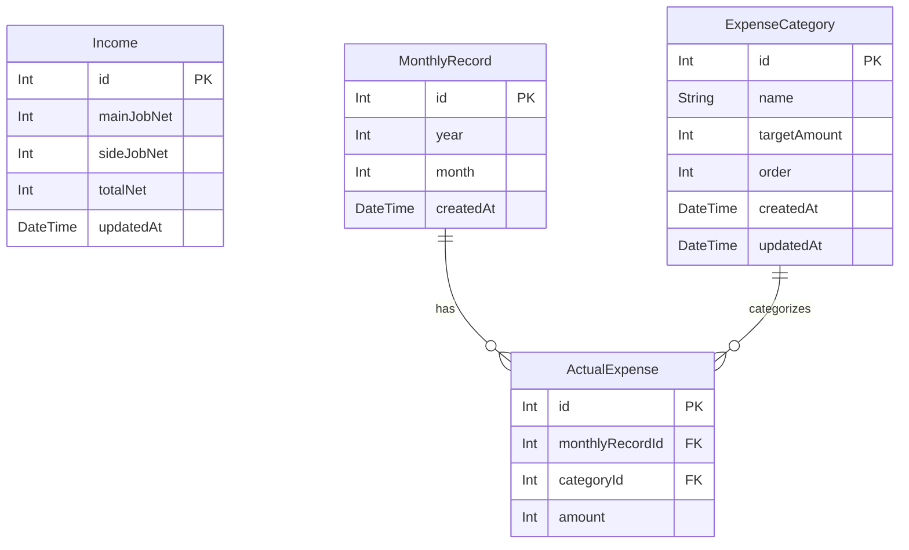

# 設計書

## アーキテクチャ概要

```
フロントエンド（Vite + React + TypeScript）
  ↓ /api プロキシ（開発時）
バックエンド（Hono + Node.js）
  ↓
PostgreSQL（Prisma ORM）
```

### 基本方針
- 画面間のリアルタイム状態共有なし（Context不要）
- データは全てDB経由で連携（各タブが独立してDBを読み書き）
- フェーズ1（フロントのみ）ではモックデータで動作を確認し、フェーズ3でAPI差し替え

---

## 画面設計

### 全体レイアウト

```
┌────────────────────────────┐
│  [収入] [月次収支] [資産計画]  ← TabBar
├────────────────────────────┤
│                            │
│     タブコンテンツ          │
│                            │
└────────────────────────────┘
```

router-dom不使用。`useState` でタブを切り替える。

---

### Tab1: 収入計算

```
┌────────────────────────────┐
│ 本業手取り  [________] 円  │
│ 副業手取り  [________] 円  │
│                            │
│ [登録]                     │
│                            │
│ 合計手取り：xxx,xxx 円      │
│ 年収：x,xxx,xxx 円         │
└────────────────────────────┘
```

**操作:**
- 本業・副業手取りを入力して登録ボタンで保存（DB上は1件のみ・上書き）
- 合計手取り・年収はリアルタイム計算して表示

---

### Tab2: 月次収支

```
┌────────────────────────────┐
│ [+ 支出入力]               │  ← モーダル起動
├────────────────────────────┤
│ 収入合計      支出合計      │
│ xxx,xxx円     xxx,xxx円     │
│                            │
│ 月次余剰      ステータス    │
│ xxx,xxx円     ● 黒字       │
├────────────────────────────┤
│ [支出内訳 円グラフ]         │  ← 実績支出のみ
├────────────────────────────┤
│ 収支一覧（2025年 < > 2026年）│  ← 年単位ページネーション
│ ┌──────┬──────┬──────┐   │
│ │  月  │ 余剰 │ 状態 │   │
│ ├──────┼──────┼──────┤   │
│ │  1月 │+25万 │ 黒字 │   │
│ │  2月 │ -3万 │ 赤字 │   │
│ │  ... │  ... │ ...  │   │
│ └──────┴──────┴──────┘   │
└────────────────────────────┘
```

**操作:**
- 収入合計はDBから取得（Income.totalNet）
- 一覧は12件固定（登録なし月は空欄）
- 各月行をクリックで詳細表示（TBD）

---

### Tab2: 支出入力モーダル

```
┌──────────────────────────┐
│ 支出入力          [× 閉] │
├──────────────────────────┤
│ 年月：[2026年] [3月]      │
├──────────────────────────┤
│ 項目         実績額       │
│ 家賃         [______] 円  │
│ 食費・日用品  [______] 円  │
│ NISA積立     [______] 円  │
│ ...                      │
├──────────────────────────┤
│ [項目管理]   [登録]       │  ← 項目管理でモーダルonモーダル
└──────────────────────────┘
```

---

### Tab2: 項目管理モーダル（モーダルonモーダル）

```
┌──────────────────────────┐
│ 項目管理          [× 閉] │
├──────────────────────────┤
│ 項目名          目標額    │
│ [家賃      ]  [70,000] 円 │
│ [食費・日用品]  [40,000] 円 │
│ ...                      │
│                [削除]     │
├──────────────────────────┤
│ [+ 項目追加]              │
│                [保存]     │
└──────────────────────────┘
```

**仕様:**
- 項目はDB（ExpenseCategory）で管理
- 目標額はカテゴリに紐づいた1件のみ（上書き更新）
- 保存で全カテゴリを一括更新

---

### Tab3: 資産計画

```
┌────────────────────────────┐
│ 現金貯金月額  [50,000] 円  │
│ 目標金額     [_______] 円  │
│                            │
│ → 達成まで xx ヶ月（xx年）  │
├────────────────────────────┤
│ NISA積立月額  [______] 円  │
│ NISA年利     [5.0]  %      │
│                            │
│ [NISAシミュレーショングラフ]│
│  x年後残高：xxx万円         │
└────────────────────────────┘
```

---

## データモデル

### Income（収入）
| カラム | 型 | 説明 |
|---|---|---|
| id | Int | PK |
| mainJobNet | Int | 本業手取り（円） |
| sideJobNet | Int | 副業手取り（円） |
| totalNet | Int | 合計手取り（mainJobNet + sideJobNet） |
| updatedAt | DateTime | 最終更新日時 |

1件のみ存在。upsertで更新し続ける。

---

### ExpenseCategory（支出項目マスタ）
| カラム | 型 | 説明 |
|---|---|---|
| id | Int | PK |
| name | String | 項目名（例: 家賃） |
| targetAmount | Int | 目標額（円） |
| order | Int | 表示順 |
| createdAt | DateTime | 作成日時 |
| updatedAt | DateTime | 更新日時 |

項目の追加・削除・目標額変更が可能。

---

### MonthlyRecord（月次実績）
| カラム | 型 | 説明 |
|---|---|---|
| id | Int | PK |
| year | Int | 年 |
| month | Int | 月（1〜12） |
| createdAt | DateTime | 作成日時 |

year + month でユニーク制約。

---

### ActualExpense（実績支出明細）
| カラム | 型 | 説明 |
|---|---|---|
| id | Int | PK |
| monthlyRecordId | Int | FK → MonthlyRecord |
| categoryId | Int | FK → ExpenseCategory |
| amount | Int | 実績額（円） |

---

### ER図



---

## 計算ロジック仕様

### 収入計算（`lib/calc/income.ts`）

```
totalNet     = mainJobNet + sideJobNet
annualIncome = totalNet × 12
```

---

### 月次収支計算（`lib/calc/monthly.ts`）

```
totalExpense = Σ actualExpenses[i].amount
surplus      = Income.totalNet - totalExpense
status       = surplus >= 0 ? '黒字' : '赤字'
```

---

### 資産計画（`lib/calc/assetPlan.ts`）

**現金貯金 達成期間:**
```
achieveMonths = ceil(目標金額 / 現金貯金月額)
achieveYears  = achieveMonths / 12
```

**NISA複利計算:**
```
monthlyRate = annualRate / 12

balance[0] = 0
balance[n] = (balance[n-1] + nisaMonthly) × (1 + monthlyRate)

// 例: 月3万・年利5%・1年後
// balance[12] ≈ 370,000円
```

---

## ディレクトリ構成

```
frontend/src/
├── App.tsx                    ← タブ切り替えのみ（router-dom不使用）
├── main.tsx
├── globals.css
│
├── tabs/                      ← タブ単位コンポーネント（pages/ を廃止）
│   ├── IncomeTab.tsx
│   ├── MonthlyTab.tsx
│   └── AssetPlanTab.tsx
│
├── components/                ← 再利用UIパーツ
│   ├── TabBar.tsx
│   ├── Modal.tsx
│   ├── PieChart.tsx
│   └── LineChart.tsx
│
├── lib/
│   ├── calc/                  ← 純粋関数（副作用なし）
│   │   ├── income.ts          ← calcIncome()
│   │   ├── monthly.ts         ← calcMonthlySummary()
│   │   └── assetPlan.ts       ← calcAchieve(), calcNisa()
│   ├── api/                   ← バックエンドAPIクライアント（フェーズ3〜）
│   │   ├── incomeApi.ts
│   │   ├── categoryApi.ts
│   │   └── monthlyApi.ts
│   └── mock/                  ← フェーズ1〜2用モックデータ
│       ├── income.ts
│       ├── categories.ts
│       └── monthlyRecords.ts
│
└── types/
    ├── index.ts               ← re-export窓口（呼び出し側のimportパスを統一）
    ├── income.ts              ← 収入系
    ├── expense.ts             ← 支出項目マスタ系
    ├── monthly.ts             ← 月次実績・計算結果系
    └── assetPlan.ts           ← 資産計画タブ計算結果系
```

---

## 型定義

Input（作成・更新時）と Output（DB取得後）でファイルを分けて管理する。
呼び出し側は常に `import { ... } from '@/types'` で統一する。

---

### `types/income.ts`

```typescript
// Input: フォーム送信時（idなし）
interface IncomeInput {
  mainJobNet: number
  sideJobNet: number
  totalNet: number
}

// Output: DB取得後（idあり）
interface Income {
  id: number
  mainJobNet: number
  sideJobNet: number
  totalNet: number
  updatedAt: Date
}
```

---

### `types/expense.ts`

```typescript
// Input: カテゴリ作成・更新時（idなし）
interface ExpenseCategoryInput {
  name: string
  targetAmount: number
  order: number
}

// Output: DB取得後（idあり）
interface ExpenseCategory {
  id: number
  name: string
  targetAmount: number
  order: number
  createdAt: Date
  updatedAt: Date
}
```

---

### `types/monthly.ts`

```typescript
// Input: 支出明細登録時（idなし）
interface ActualExpenseInput {
  categoryId: number
  amount: number
}

// Output: DB取得後（idあり・categoryNameはJOIN済み）
interface ActualExpense {
  id: number
  monthlyRecordId: number
  categoryId: number
  categoryName: string
  amount: number
}

// Input: 月次実績登録時（idなし）
interface MonthlyRecordInput {
  year: number
  month: number
  actualExpenses: ActualExpenseInput[]
}

// Output: DB取得後（idあり）
interface MonthlyRecord {
  id: number
  year: number
  month: number
  actualExpenses: ActualExpense[]
  createdAt: Date
}

// 計算結果（DBなし・純粋関数の戻り値）
interface MonthlySummary {
  totalIncome: number
  totalExpense: number
  surplus: number
  status: '黒字' | '赤字'
}
```

---

### `types/assetPlan.ts`

```typescript
// 計算結果（DBなし・純粋関数の戻り値）
interface NisaRow {
  month: number
  balanceBeforeInterest: number
  balanceAfterInterest: number
}
```

---

## フェーズ計画

→ [フェーズ計画.md](./フェーズ計画.md) を参照
